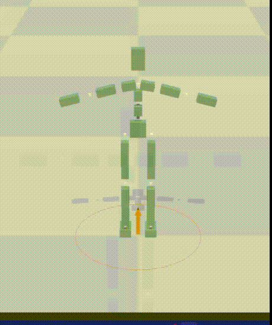
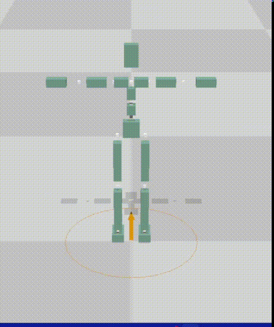

# Project

本次Project希望你对角色动画知识进行进一步应用，来制作一个较为完整的动画项目。我们将给出多个题目供你选择，具体分为kinematics方向和physics方向。你可以延续lab2的可交互动画的内容，去构建一个更加完善的Motion Graph，或者使用Motion Matching来实现更为精准实时的控制；也可以延续lab3的物理控制的角色动画内容，来实现更加复杂的操作角色的效果（可以加上root force）或者更加真实的控制行为（不加root force）。当然你也可以把kinematics那边的任何方案移植到physics这边。

--------------------------------------------
## 任务零  环境配置 
--------------------------------------------

### 1. 安装panda3d(Windows/Linux/Mac)
   
Windows建议使用conda等建立新的虚拟环境
```bash
conda create -n MoCCA python=3.8
conda activate MoCCA
conda install numpy scipy
pip install panda3d
```
MacOS环境建议使用virtualenv建立新的虚拟环境
```bash
python3 -m venv MoCCA
source MoCCA/bin/activate
pip install numpy scipy
pip install panda3d
cd MoCCASimuBackend
pip install .
```
如果下载过慢可使用清华镜像源安装 ( https://mirrors.tuna.tsinghua.edu.cn/help/anaconda/ )

> 本作业只允许使用 `numpy`， `scipy`以及其依赖的库。评测时也以此为准。作业文件中需要使用其他库请提前跟助教申报。

> MoCCASimuBackend为本次作业的仿真后端，需要使用cmake进行编译，MacOS可以使用brew安装（需要先安装homebrew）
```bash
brew install cmake
```
目前提供了Windows上编译好的动态链接库（python3.8和3.10版本），不需要安装了。
> 如果在import MoCCASimuBackend时遇到numpy有关的报错，请更新numpy版本>=1.23，并卸载后重新编译安装。


完成后可以运行`task0_build_and_run.py`，可以调节`simu_flag`来选择是否使用physics来更新。你将会看到一个地面上的黄色圆圈。你可以通过键盘或左手柄来控制它的移动。可以通过鼠标左右中键或右手柄操作相机视角。(检测到手柄会无视键盘输入，具体情况请参考`task_0_build_and_run.py`的注释.) 如果`simu_flag=0`, 你将会看到一个起始T-pose的角色，角色将一致保持T-pose。如果`simu_flag=1`，随着物理仿真他会跌倒在地上。

<p float=left>
 
 
</p>

--------------------------------------------
## 数据 
--------------------------------------------

在`motion_material`文件夹我们提供一些基本的动作数据。包含一些短motion和两个长motion。你可以使用blender等软件查看长motion，并剪辑出需要的短motion。

短motion:
- idle_: 站立不动
- kick_: 向前踢腿若干次，有左有右，可以自行裁剪
- walk_forward_: 向前走两步，先右脚后左脚
- run_forward_： 向前跑两步，先右脚后左脚
- walkF_: 向前走四步，首尾的局部动作是loop的
- walk_and_turn_left_： 走两步然后向左转
- walk_and_turn_right_： 走两步然后向右转，由上一个动作镜像得到

长motion主要是walk,run和他们对应的镜像版本。我们提供kinematic和physics两个版本。前者由动捕数据重定向得到。后者是使用[Supertrack](https://montreal.ubisoft.com/en/supertrack-motion-tracking-for-physically-simulated-characters-using-supervised-learning/)方法在物理环境中重现一遍。后者的好处是不会有地面穿透，脚底打滑等非物理问题。缺点是动作比较保守，且有时候会抖动(双臂平举时比较明显)。可以根据需要进行选取。

你也可以自行去[SFU-dataset](https://mocap.cs.sfu.ca/)上去选取你觉得有意思的短motion，或者去[LaFaN-dataset](https://opendatalab.com/LaFAN1)选择你觉得不错的长motion。

--------------------------------------------
## 方案一 继续完善Motion Graph
--------------------------------------------
在lab2的interactive_character的任务中，我们给出了一个简单的Motion Graph。里面给出的5个动画clip被手工修理成起始帧和结束帧的角色位姿接近的样子，以方便进行直接拼接。这样的图是手工设计出来的。自动地去生成动画之间的连接关系图势必会减轻动画师的工作量，并且可能可以发掘出一些手工连接动画时候的新的连接方式。比如说，我们知道走路片段可以分别衔接跑步或者踢腿，但是自动去算连接点的算法，可能会找出一个transit point来使得跑步动作去衔接上踢腿动作，能实现一种较为连续的连接。

[Motion Graphs论文连接](https://research.cs.wisc.edu/graphics/Papers/Gleicher/Mocap/mograph.pdf).

--------------------------------------------
## 方案二 使用Motion Matching进行更及时的控制
--------------------------------------------
在有长motion的情况下，Motion Matching方法不需要对动作进行切割，也不需要自己定义动作转移,搭建起来甚至更加简单。其核心思想是，不再人为指定动作之间的转换关系，而是单纯地指定目标动作，而从当前动作到目标动作之间的插帧，是算法从动作数据库中自动找出一个最佳匹配，或者根据已有的动作数据，基于插值生成一个新的，最合理的动作。

Motion Matching相关背景知识可以参考[Toturial](https://theorangeduck.com/page/code-vs-data-driven-displacement)和对应[代码仓库](https://github.com/orangeduck/Motion-Matching)。

一些小Tips:
- 速度和角速度是非常重要的动作特征，一般通过有限差分计算得到。我们在`smooth_utils.py`里给出了计算角速度的方法以供参考。
- Motion Matching需要手动让动作转移更加平滑，也即[Inertialization](https://theorangeduck.com/page/spring-roll-call#inertialization)的方法。其中需要的damped spring我们在`smooth_utils.py`里给出了一个实现。


[Motion Matching的发布会](https://www.gdcvault.com/play/1023280/Motion-Matching-and-The-Road).

--------------------------------------------
## 方案三 基于机器学习的kinematics动画
--------------------------------------------
基于机器学习的kinematics动画进行可交互的过程大致可以认为是，通过学习合理的动作的分布，并将其和用户输入对应起来。

能够实现交互角色动画的learnning方法有很多，我们简单列出一些，你可以根据下面的某一个方法来进行复现

- [Learned Motion Matching](https://github.com/orangeduck/Motion-Matching)
- [Phase-Functioned Neural Networks for Character Control](https://github.com/sreyafrancis/PFNN)


--------------------------------------------
## 方案四 丰富PD控制的动画
--------------------------------------------
在lab3中的task2我们使用了一个在root上加一个外力的方法实现了磕磕绊绊地走。你可以继续在root上加一个力来保证平衡来完成更多的动作，比如说跑步，转弯，踢腿，以及他们之间的转换动画。

--------------------------------------------
## 方案五 更真实的PD控制算法
--------------------------------------------
在lab3中的task3我们取消了root上的外力，而让角色可以保持平衡。你可以继续延申下去，来在不使用root residue force等破坏物理规律的情况下使得角色可以能够基本走路。


--------------------------------------------
## 评分标准
--------------------------------------------

由于给出的五个方案的难度有差别，我们会根据方案的难度，以及最终动作效果来进行打分。较难的方案的基础分高，并且相应的动作质量可以酌情降低。各个方案的分数上限都是100分。当然你也可以选择其他方案，请提前联系助教确认难度。

动作效果评价将包括以下几个因素：
>  * 动作对控制信号的响应速度，例如转向到位的速度
>  * 动作的物理准确性，例如是否脚底打滑
>  * 不同动作之前切换的流畅程度，以及是否有明显的跳变
>  * 动作的种类和自然感

以下是五个方案的基本要求，以及对应完成基本要求的得分。其他自选方案的基础分请咨询助教。

---
**方案一 (Motion Graphs)**: 

完成以下任务可获得基础分 `75` 分
>  * 使用 5 个以上与 lab2 中提供的数据不同的动作片断
>  * 支持走、跑、转向、停止、以及任意非走和跑的动作，以及这些动作间的切换
>  * 角色可以响应键盘/摇杆的方向控制。

完成以下内容可以在75分基础上额外获得基础分加分，最多10分。
>  * 参考 `viewer\viewer_new.py` 中的 `create_marker` 函数添加新的键盘响应以触发走、跑之外的其他动作 (例如通过空格出发跳跃等)，每个动作+1分，最多+5分。
>  * 将角色上半身和下半身分开控制，使得角色可以组合新的动作，并使用键盘触发 （例如构建上下半身单独的 motion graphs），+5分
>  * 基于 MotionGraph 论文或其他论文实现了从运动数据自动建立动作图。请同时提交自动建图的代码，+5分。

---
**方案二 (Motion Matching)**: 

实现 Motion Matching 算法，并完成以下任务可获得基础分 `85` 分
>  * 至少支持走、跑、转向动作，以及他们之间的切换
>  * 能及时响应跑、走、转向的键盘/摇杆控制
>  * 转向时有明显的转向动作，整体动作没有明显的跳变
>  * 提供实现方法说明

---
**方案三 (Learning-based Methods）**:

完成以下任务可获得基础分 `85` 分

>  * 利用神经网络训练动作生成模型，支持走、跑、转向动作，以及他们之间的切换
>  * 能及时响应跑、走、转向的键盘/摇杆控制
>  * 转向时有明显的转向动作，整体动作没有明显的跳变
>  * 提交预处理和训练的代码，以及训练好的模型
>  * 提交网络结构和训练方法的说明

---
**方案四 (PD Control with Residual Force)**: 

通过在 root 上加 residual force 保持平衡，使角色可以在仿真中跟踪上述方案一 ~ 方案三中任意方案获得的动作，可以获得 `+5` 分的基础分。要求
>  * 完成方案一 ~ 方案三中对应方案的基础要求
>  * 角色在移动过程中没有明显的倾倒、弹跳等问题

---
**方案五 (Physics-based Control)**:

> 在不使用任何 residual force 的情况下，角色可以保持平衡，并以双脚步行的方式向前移动，在摔倒前至少行走 `5` 米，获得基础分 `90` 分。

> 通过强化学习或最优控制等方法，学习控制策略，使角色可以长时间行走，并可以承受一定的干扰（如水平随机推力，要求提供施加干扰的接口），获得基础分 `95` 分

--------------------------------------------
## 提交
--------------------------------------------

需要提交的文件是`answer_project.py`和关于项目的说明文档。你对于项目其他文件进行的修改，请一并提交。

如果你对于`task1_project.py`或者其他文件进行修改了，请在项目文档写清楚如何使用你的文件。你的project可以完成一个什么样的效果，请写一个文档来说明(pdf或者markdown格式)，如果你使用了额外的数据集，也请一并附上来。最终上交时请打包成zip格式。
